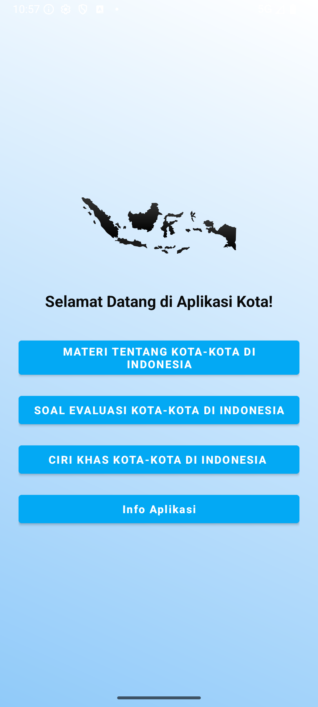
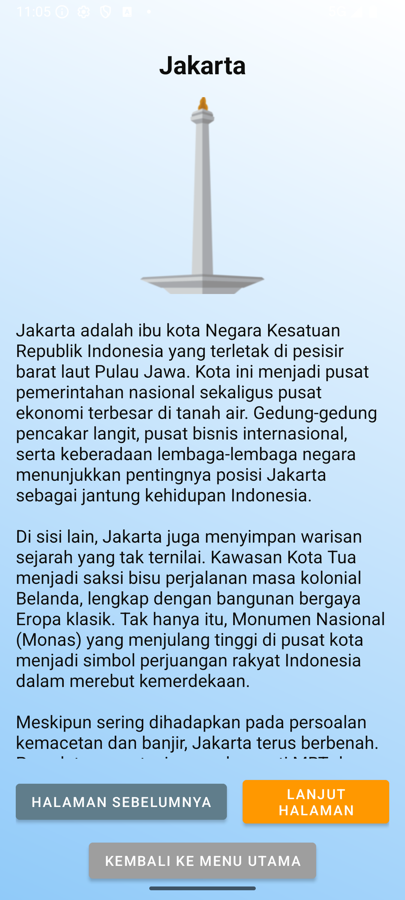
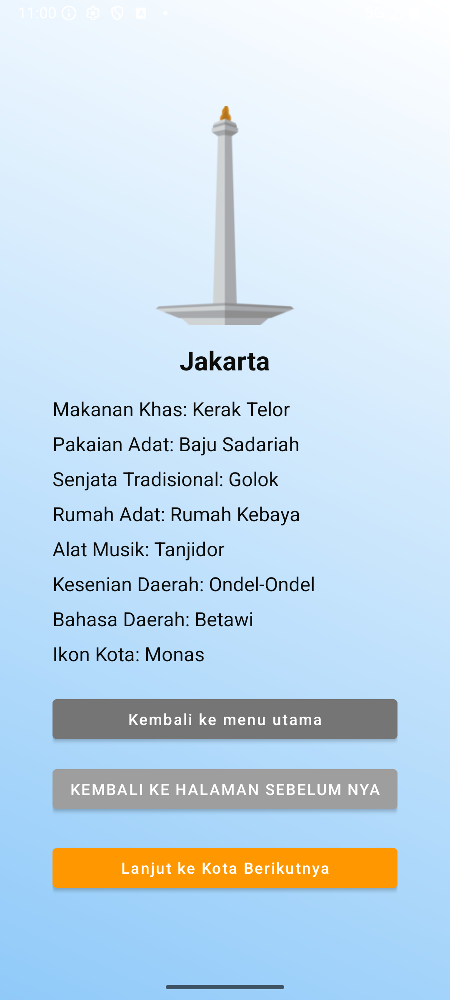
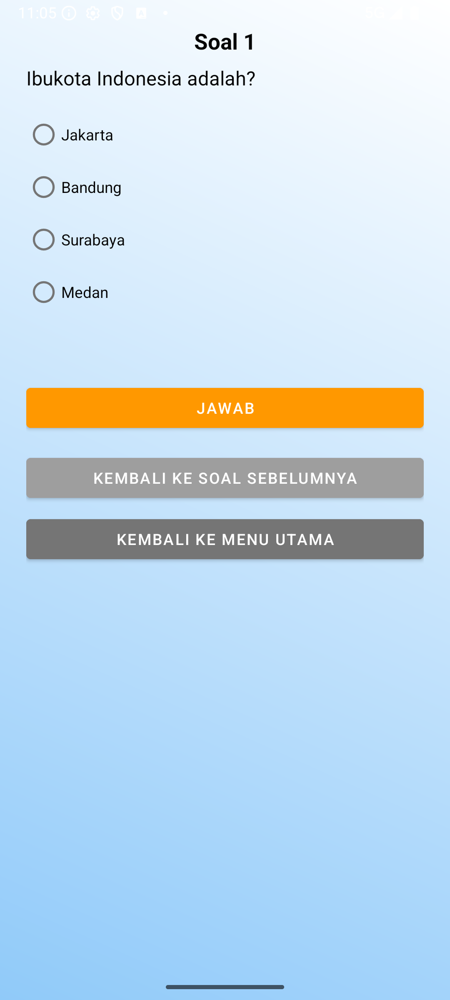

# Edukasi Kota-Kota di Indonesia (Android)

Aplikasi Android edukatif yang mengenalkan 20 kota di Indonesia: materi kota, ciri khas budaya, dan kuis interaktif. Proyek mata kuliah Pemrograman Mobile.

## 📸 Tampilan Aplikasi

| Menu Utama | Materi Kota | Ciri Khas Budaya | Kuis |
|:---:|:---:|:---:|:---:|
|  |  |  |  |

## Fitur Utama

- **Materi kota** — informasi 20 kota di Indonesia (Jakarta, Surabaya, Bandung, Medan, Yogyakarta, Padang, Makassar, Denpasar, dan lainnya) dengan navigasi sebelumnya/berikutnya.
- **Ciri khas budaya** — menampilkan makanan, pakaian, senjata, rumah adat, musik, kesenian, bahasa, dan ikon tiap kota.
- **Kuis** 29 soal pilihan ganda seputar kota-kota Indonesia dengan penilaian otomatis.
- **Halaman nilai** — menampilkan skor akhir beserta keterangan kelulusan.

## Teknologi

| Aspek | Detail |
|---|---|
| Bahasa | Java |
| Min SDK | 26 (Android 8.0) |
| Target/Compile SDK | 35 |
| UI | Activity + ScrollView, ConstraintLayout |
| Build | Gradle (Kotlin DSL) |

## Struktur Kode

```
app/src/main/java/app/example/projekkota/
├── MainActivity.java        # Menu utama (Materi, Soal, Ciri Khas, Info)
├── MateriActivity.java      # Materi kota
├── CiriKhasActivity.java    # Ciri khas budaya per kota
├── CiriKhasKota.java        # Model data ciri khas
├── QuizActivity.java        # Kuis pilihan ganda (29 soal)
├── NilaiActivity.java       # Skor hasil kuis
└── InfoActivity.java        # Informasi aplikasi
```

## Cara Menjalankan

1. Buka folder proyek di **Android Studio**.
2. Sync Gradle (otomatis saat pertama dibuka).
3. Jalankan pada emulator atau perangkat (Android 8.0+).

## Catatan

Proyek ini dibuat untuk tujuan pembelajaran dasar pengembangan Android (navigasi antar-Activity, penyajian materi, dan logika kuis).
